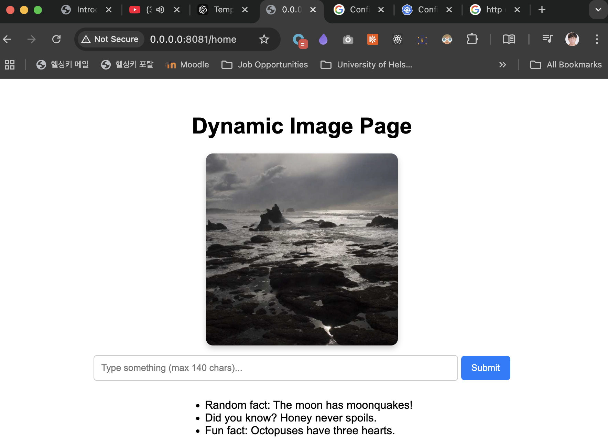

# Requirements

Since the project looks a bit boring right now, let's add a picture!

The goal is to add an hourly image to the project.

Get a random picture from Lorem Picsum like https://picsum.photos/1200 and display it in the project. Find a way to store the image so it stays the same for 60 minutes.

Make sure to cache the image into a volume so that the API isn't needed for new images every time we access the application or the container crashes.

The best way to test what happens when your container shuts down is likely by shutting down the container, so you can add logic for that as well, for testing purposes.

# Solution

## Configuring a persistent volume for the deployment

I reuse the `persistentvolume.yaml` and `persistentvolumeclaim.yaml` from the previous exercise. Then, I configure my deployment to use this persistent volume:

```
apiVersion: apps/v1
kind: Deployment
metadata:
  name: dwk-project
spec:
  ...
  template:
    ...
    spec:
      volumes:
          - name: shared-image
            persistentVolumeClaim:
              claimName: image-claim
      containers:
        - name: dwk-project
          ...
          volumeMounts:
          - name: shared-image
            mountPath: /usr/src/app/files
```

## Building the frontend

We now need a frontend for our project. I decide to use an html template to render my simple frontend. This html page will need to fetch images dynamically from storage (in this case, `persistent volume`) so using html templates would be a good choice. I take a sneak peek at the next exercise and pre-build the required user interface, with the help of `ChatGPT`.



The html source for the above screenshot takes an argument for the `image_path`. When the argument changes, the image will also change.

```
<body>
    ...
    
    ...
</body>
```

I use the python package `jinja2` and use `fastapi.templating.Jinja2Templates` to pass arguments from the `python` file to the `html template`.

I always pass `/usr/src/app/files/assets/image.jpg` to the html template. (I realized I could have just hard-coded this path into the html but oh well... Perhaps it will come in handy later.) Note that the path `/usr/src/app/files` belongs to the persistent volume.

## New endpoint to return the html

I set up a new endpoint that returns the `html` file defined above upon request. Note that I always pass `/assets/image.jpg` to the html template. When this image needs to change, I will simply overwrite `image.jpg` with a different image file.

```
@app.get("/home", response_class=HTMLResponse)
def read_root(request: Request):
    ...
    return templates.TemplateResponse("home.html", {"request":request, "image_path": "/assets/image.jpg"})
```

An additional note is that the app's working directory is `/usr/src/app`, and it can be omitted from the file path.

## Reload logic

I write a function that saves to the persistent volume an image file and a text file that contains the evoked timestamp.

```
def download_image_and_leave_logs():
    # make request
    response = requests.get('https://picsum.photos/1000')

    # save image
    with open(app.state.image_path, 'wb') as file:
        file.write(response.content)
    
    # save refresh time
    with open(app.state.last_updated_path, 'w') as file:
        file.write(datetime.datetime.now().strftime('%Y-%m-%d_%H:%M:%S'))
```

Then I add to the endpoint some logic that reloads the image every hour. It reads the previously saved timestamp from the volume, compares it to local time, and fetches a new image if a certain duration has past since the last fetch.

 For testing purposes, I first set the reload interval to 10 seconds, then change it to 60*60=3600 seconds later.

```
@app.get("/home", response_class=HTMLResponse)
def read_root(request: Request):
    # download random image if not exist
    if "image.jpg" not in os.listdir(app.state.assets_dir):
        download_image_and_leave_logs()
    
    # check refresh time, if > 60 minutes, fetch again
    now = datetime.datetime.now()
    with open(app.state.last_updated_path, 'r') as file:
        last_updated = datetime.datetime.strptime(file.read(), '%Y-%m-%d_%H:%M:%S')
    
    if (now - last_updated).seconds > 10:
        print('INFO:\tImage has expired. Downloading new images...')
        download_image_and_leave_logs()
    return templates.TemplateResponse("home.html", {"request":request, "image_path": "/assets/image.jpg"})
```

## Deploy to cluster

Let's deploy this application to the cluster. I write a small makefile to automate the deployment process:

```
deploy:
	@docker build . --tag dwk-project:1.12.0
	@k3d image import dwk-project:1.12.0
	@kubectl delete -f manifests/
	@kubectl apply -f manifests/
	@sleep 5
	@kubectl get deployments
	@kubectl get services
	@kubectl get pods
```

Now I can build the docker image, import it to the cluster, take down previous deployments and launch new deployments with a simple command `make deploy`. It also waits 5 seconds (arbitrarily selected) for the deployment to complete.

- Let's see the results of `make deploy`:

```
[+] Building 0.3s (9/9) FINISHED 
 => exporting to image
 => => exporting layers
 ...
 => => naming to docker.io/library/dwk-project:1.12.0
 => => unpacking to docker.io/library/dwk-project:1.12.0

INFO[0000] Importing image(s) into cluster 'k3s-default' 
INFO[0000] Starting new tools node...                   
INFO[0000] Starting node 'k3d-k3s-default-tools'        
INFO[0000] Saving 1 image(s) from runtime...            
INFO[0002] Importing images into nodes...               
...
INFO[0004] Successfully imported image(s)               
INFO[0004] Successfully imported 1 image(s) into 1 cluster(s) 

deployment.apps "dwk-project" deleted
ingress.networking.k8s.io "dwk-material-ingress" deleted
persistentvolume "example-pv" deleted
persistentvolumeclaim "image-claim" deleted
service "dwk-project-svc" deleted

deployment.apps/dwk-project created
ingress.networking.k8s.io/dwk-material-ingress created
persistentvolume/example-pv created
persistentvolumeclaim/image-claim created
service/dwk-project-svc created

NAME          READY   UP-TO-DATE   AVAILABLE   AGE
dwk-project   1/1     1            1           5s
NAME              TYPE        CLUSTER-IP     EXTERNAL-IP   PORT(S)    AGE
dwk-project-svc   ClusterIP   10.43.111.91   <none>        2345/TCP   5s
kubernetes        ClusterIP   10.43.0.1      <none>        443/TCP    10h

NAME                           READY   STATUS    RESTARTS   AGE
dwk-project-8548b9d546-c8vww   1/1     Running   0          5s
```

Great, now let's test the functionality of the web page.

## Functionality test

I configured my server application to leave logs whenever a new fetch occurs due to timeout.

```
if (now - last_updated).seconds > 10:
    print('INFO:\tImage has expired. Downloading new images...')
    download_image_and_leave_logs()
```

I run `kubectl logs deployments/dwk-project -f` to monitor the logs of the container, access the endpoint via browser, and hit reload a few times:

```
INFO:     Started server process [1]
INFO:     Waiting for application startup.
INFO:     Application startup complete.
INFO:     Uvicorn running on http://0.0.0.0:7777 (Press CTRL+C to quit)
INFO:   Image has expired. Downloading new images...
INFO:     10.42.1.6:42296 - "GET /home HTTP/1.1" 200 OK
INFO:     10.42.1.6:42296 - "GET /assets/image.jpg HTTP/1.1" 200 OK
INFO:     10.42.1.6:42296 - "GET /home HTTP/1.1" 200 OK
INFO:     10.42.1.6:42296 - "GET /assets/image.jpg HTTP/1.1" 304 Not Modified
INFO:     10.42.1.6:42296 - "GET /home HTTP/1.1" 200 OK
INFO:     10.42.1.6:42296 - "GET /assets/image.jpg HTTP/1.1" 304 Not Modified
INFO:     10.42.1.6:42296 - "GET /home HTTP/1.1" 200 OK
INFO:     10.42.1.6:42296 - "GET /assets/image.jpg HTTP/1.1" 304 Not Modified
INFO:     10.42.1.6:42296 - "GET /home HTTP/1.1" 200 OK
INFO:     10.42.1.6:42296 - "GET /assets/image.jpg HTTP/1.1" 304 Not Modified
INFO:     10.42.1.6:42296 - "GET /home HTTP/1.1" 200 OK
INFO:     10.42.1.6:42296 - "GET /assets/image.jpg HTTP/1.1" 304 Not Modified
INFO:   Image has expired. Downloading new images...
INFO:     10.42.1.6:42296 - "GET /home HTTP/1.1" 200 OK
INFO:     10.42.1.6:42296 - "GET /assets/image.jpg HTTP/1.1" 200 OK
INFO:     10.42.1.6:42296 - "GET /home HTTP/1.1" 200 OK
INFO:     10.42.1.6:42296 - "GET /assets/image.jpg HTTP/1.1" 304 Not Modified
INFO:   Image has expired. Downloading new images...
INFO:     10.42.1.6:43820 - "GET /home HTTP/1.1" 200 OK
INFO:     10.42.1.6:43820 - "GET /assets/image.jpg HTTP/1.1" 200 OK
```

We see that the server fetching new images once a timeout occurs.

For the final touch, I revert the timeout duration to 60*60=3600 seconds, to make it fetch new images every hour.

```
@app.get("/home", response_class=HTMLResponse)
def read_root(request: Request):
    ...
    if (now - last_updated).seconds > 60*60:
        print('INFO:\tImage has expired. Downloading new images...')
        download_image_and_leave_logs()
    return templates.TemplateResponse("home.html", ...)
```