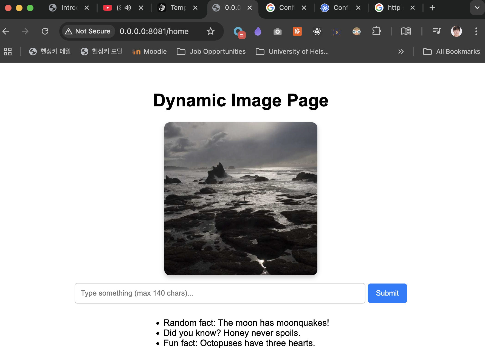

# Requirements

For the project, we'll need to do some coding to start seeing results in the next part.

Add an input field. The input should not take todos that are over 140 characters long.
Add a send button. It does not have to send the todo yet.
Add a list of the existing todos with some hardcoded todos.

# Solution

I already fulfilled the requirements of this exercise in the last one!
