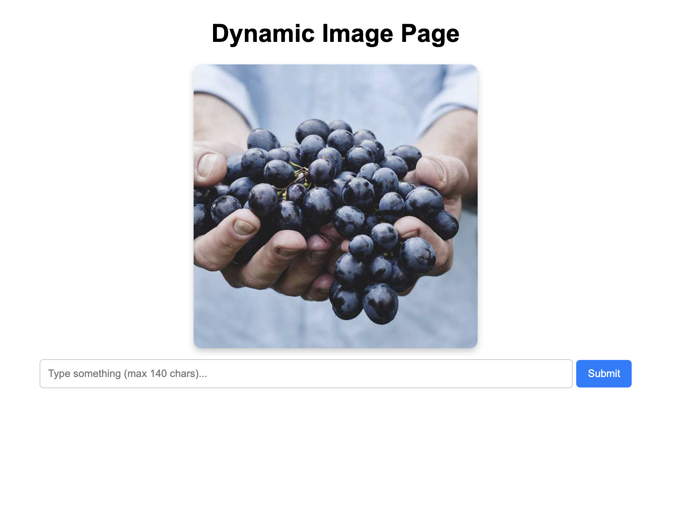
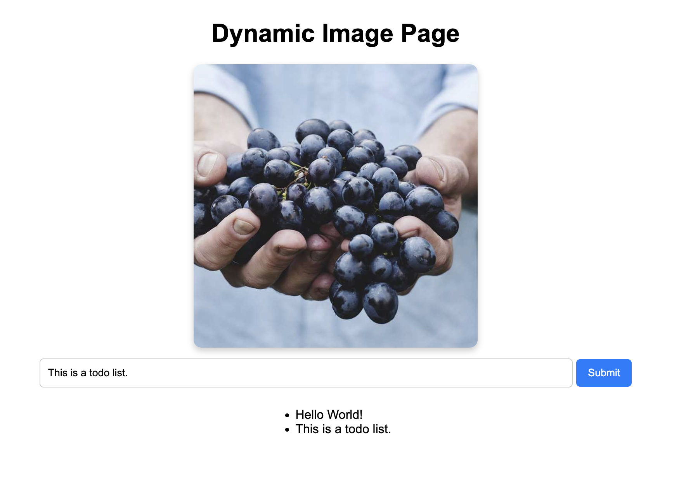

# Requirements

Let us get back to our Project. In the previous part we added a random pic and a form for creating todos to the app. The next step is to create a new container that takes care of saving the todo items.

This new service, let us call it todo-backend, should have a GET /todos endpoint for fetching the list of todos and a POST /todos endpoint for creating a new todo. The todos can be saved into memory, we'll add a database later.

Use ingress routing to enable access to the todo-backend.

The role of the service that we made in previous exercises (Todo-app in the figure) is to serve the HTML and possibly JavaScript to the browser. Also, the logic for serving random pictures and caching those remain in that service.

The new service then takes care of the todo items.

After this exercise, you should be able to create new todos using the form, and the created todos should be rendered in the browser.

# Solution

## Creating a new microservice deployment

```
import uvicorn, os
from fastapi.encoders import jsonable_encoder
from fastapi import FastAPI, Request

# initialize FastAPI app
app = FastAPI()
host = "0.0.0.0"  
port = int(os.environ["PORT"])

# manage todos in memory before moving on to databases
app.state.todos = []

@app.post("/todos")
async def create_todo(request: Request):
    # parse body & save todo
    body = await request.json()
    app.state.todos.append(body["todo"])
    return {"message": "OK"}

@app.get("/todos")
def get_todos():
    return jsonable_encoder(app.state.todos)

# if this file is the entrypoint, start the server app
if __name__ == "__main__":
    uvicorn.run(app, host=host, port=port)
```

This python server will manage our todos through `POST /todos` and `GET /todos`. Let's test if it works as intended:

- `PORT=7777 python todo_backend.py`

    ```
    INFO:     Started server process [49550]
    INFO:     Waiting for application startup.
    INFO:     Application startup complete.
    INFO:     Uvicorn running on http://0.0.0.0:7777 (Press CTRL+C to quit)
    ```

- `curl -X POST 127.0.0.1:7777/todos  -d '{"todo": "Do something"}'`

    ```
    {"message":"OK"}
    ```

- `curl -X POST 127.0.0.1:7777/todos  -d '{"todo": "Do something else"}'`

    ```
    {"message":"OK"}
    ```

- `curl 127.0.0.1:7777/todos`

    ```
    ["Do something","Do something else"]
    ```

Nice. Now let's configure some networking and deploy this.

## Setting up kubernetes environments

I create a `Dockerfile` for my newly created server application. I add it to `deployment.yaml` to run it inside the same pod, and assign a different port (`7778`) from the `todo-app` container port (`7777`). I also rename resources related to the existing service so I can differentiate between the existing and newly created app.

- `main.py` -> `todo_app.py`
- `Dockerfile` -> `todo-app.Dockerfile`
- `todo_backend.py` - newly created
- `todo-backend.Dockerfile` - newly created
- `deployment.yaml`

    ```
    ...
        containers:
            - name: todo-app
            image: todo-app:2.2.0
            imagePullPolicy: Never
            env:
                - name: PORT
                value: "7777"
            volumeMounts:
            - name: shared-image
                mountPath: /usr/src/app/files
            - name: todo-backend
            image: todo-backend:2.2.0
            imagePullPolicy: Never
            env:
                - name: PORT
                value: "7778"
    ```

- `ingress.yaml`

    ```
    ...
    paths:
        - path: /
            pathType: Prefix
            backend:
            service:
                name: dwk-project-svc
                port:
                number: 7777
        - path: /todos
            pathType: Prefix
            backend:
            service:
                name: dwk-project-svc
                port:
                number: 7778
    ```

- `service.yaml`

    ```
    ...
    ports:
        - port: 7777
        name: todo-app
        protocol: TCP
        targetPort: 7777
        - port: 7778
        name: todo-backend
        protocol: TCP
        targetPort: 7778
    ```


## Deployment to the cluster

I create yet another makefile to aid my deployment.

```
deploy:
	@docker build -f todo_app.Dockerfile . --tag todo-app:2.2.0 && echo "\n"
	@docker build -f todo_backend.Dockerfile . --tag todo-backend:2.2.0 && echo "\n"
	@k3d image import todo-app:2.2.0 todo-backend:2.2.0 && echo "\n"
	@kubectl delete -f manifests/ && echo "\n"
	@kubectl apply -f manifests/ && echo "\n"
	@sleep 5
	@kubectl get deployments && echo "\n"
	@kubectl get services && echo "\n"
	@kubectl get pods
```

- `make deploy`

    ```
    ...
    deployment.apps "dwk-project" deleted
    ingress.networking.k8s.io "dwk-material-ingress" deleted
    persistentvolume "example-pv" deleted
    persistentvolumeclaim "image-claim" deleted
    service "dwk-project-svc" deleted

    deployment.apps/dwk-project created
    ingress.networking.k8s.io/dwk-material-ingress created
    persistentvolume/example-pv created
    persistentvolumeclaim/image-claim created
    service/dwk-project-svc created
    ...
    ```

Let's test the endpoints via ingress:

- `curl 127.0.0.1:8081/todos`

    ```
    []
    ```

- `curl -X POST 127.0.0.1:8081/todos -d '{"todo": "Do something"}'`

    ```
    {"message":"OK"}
    ```

- `curl -X POST 127.0.0.1:8081/todos -d '{"todo": "Do something else"}'`

    ```
    {"message":"OK"}
    ```

- `curl -X POST 127.0.0.1:8081/todos -d '{"todo": "This is a todo list."}'`

    ```
    {"message":"OK"}
    ```

- `curl 127.0.0.1:8081/todos`

    ```
    ["Do something","Do something else","This is a todo list."]
    ```

APIs are successfully set up via kubernetes.

## Frontend logic

Now I add functionalities to the frontend html. I make it call `GET /posts` repeatedly every 0.5 seconds. I also make a request to `POST /posts` when the `Submit` button is pressed.

```
<script>
    const getTodoUrl = "{{ get_todo_url }}";  
    function fetchItems() {
        fetch(getTodoUrl)
        .then(response => response.json())
        .then(data => {
            const list = document.getElementById("item-list");
            list.innerHTML = "";  // Clear old items
            data.forEach(item => {
                const li = document.createElement("li");
                li.textContent = item;
                list.appendChild(li);
            });
        })
        .catch(error => console.error("Error fetching items:", error));
    }

    // Fetch items every 2 seconds
    setInterval(fetchItems, 500);
</script>


<script>
    const postTodoUrl = "{{ post_todo_url }}";  
    function sendPostRequest() {
        const textValue = document.getElementById("todo_input").value;
        fetch(postTodoUrl, {
            method: 'POST',
            headers: { 'Content-Type': 'application/json' },
            body: JSON.stringify({ todo: textValue })  // Send input value as JSON
        })
    }
</script>
```

As for the parameters `get_todo_url` and `post_todo_url`, I pass them to the html template from the python server.

    ```
    ...
    get_todo_url = "http://0.0.0.0:8081/todos"
    post_todo_url = "http://0.0.0.0:8081/todos"
    return templates.TemplateResponse("home.html", {
        "request":request,
        "image_path": image_path,
        "get_todo_url":get_todo_url, 
        "post_todo_url":post_todo_url
    })
    ```

Note that I am passing urls corresponding to the `ingress`. This is because javascript runs from the browser, which is outside the kubernetes pod. Therefore I cannot leverage communication within pods, and I must make requests through the `ingress` to reach the pod.

Afterward I run `make deploy` to reflect my changes to the cluster.

## Results





Everything functions correctly as intended!
